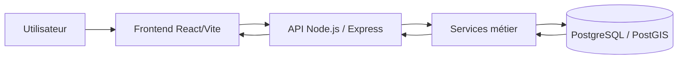
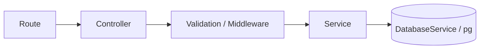
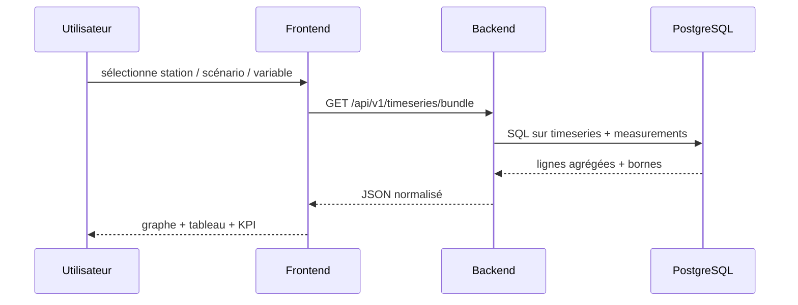

# Global Architecture

L’architecture est de type client-serveur. Le frontend récupère les données depuis une API REST. Le backend interroge PostgreSQL/PostGIS et normalise les réponses au format JSON. Les couches métier (stations, timeseries, cartes, indicateurs) sont traitées via des services dédiés.

Cette architecture a été pensée pour séparer clairement:

- la présentation UI
- la logique métier
- l’accès aux données
- la sécurité applicative
- les usages analytiques temps réel ou semi temps réel

## Vue d’ensemble

L’application peut se lire en 4 couches:

1. interface utilisateur React
2. routeur et protection des pages
3. API Express et services métier
4. base PostgreSQL/PostGIS avec vues et tables

## Flux principal

## Chaîne backend

## Cycle d’une requête dashboard

## Couches d’architecture

| Couche | Détail |
|---|---|
| Présentation | React, router, context, composants UI |
| API | Express, controllers, routes, middlewares |
| Métier | services hydro, spatial, auth, scan, auth admin |
| Données | PostgreSQL, PostGIS, vues, tables, matérialisées |

## Responsabilités par couche

| Couche | Responsabilité |
|---|---|
| Frontend | afficher, filtrer, naviguer, exporter |
| Backend | sécuriser, valider, calculer, sérialiser |
| DB | persister, indexer, géocoder, historiser |

## Découpage fonctionnel

- **Public**: accueil, contact, login
- **Métier**: dashboard, cartes, tableaux, analyses
- **Admin**: gestion utilisateurs et accès
- **Données**: timeseries, stations, bassins, objets spatiaux

## Observations importantes

- le frontend est piloté par des contexts métier et par TanStack Query
- les graphiques utilisent Recharts
- la cartographie repose sur Leaflet
- le backend expose des routes spécialisées par domaine
- la base utilise PostGIS pour les couches spatiales

## Lecture à garder en tête

Le projet n’est pas une simple application de visualisation. Il sert de couche d’interprétation entre:

- les séries temporelles
- les objets spatiaux
- les règles métier du barrage Hassan Addakhil
- les besoins de consultation et d’export
