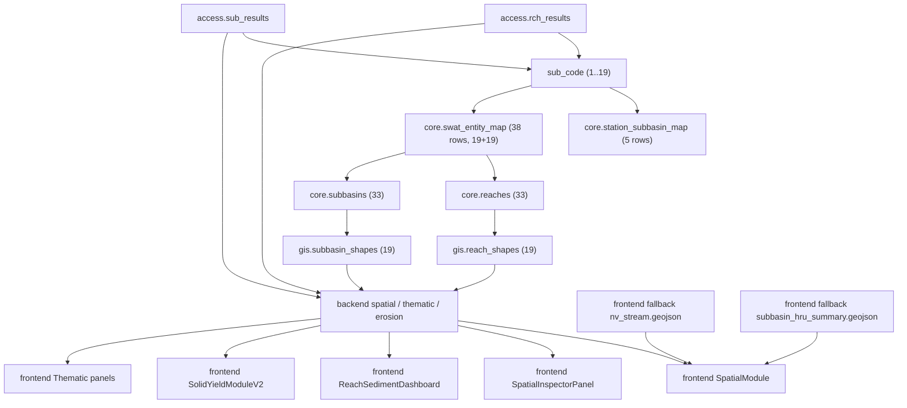

# AUDIT DQ5 REACHES / SUBBASINS / MAPPING SWAT - HASSAN ADDAKHIL

Date audit: 2026-08-10
Heure audit: 15:18
Timezone: Africa/Casablanca
Mode: lecture seule stricte
Branche Git observee: `ilh_dev_20-07`
Commit de reference: `99c1089e9f0588fdbd8e8872302295cb88bbdaf6`

Aucune correction n'a ete appliquee.
Aucune ecriture SQL n'a ete effectuee.
Aucun fichier applicatif n'a ete modifie.
Aucun changement PostgreSQL, Docker, backend, frontend ou scripts n'a ete realise.

## 1. Resume executif

Verdict global: la chaine SWAT Reach/Subbasin/Mapping est **partiellement operationnelle**, mais **structurellement incoherente**.

Etat global:

- La plateforme fonctionne aujourd'hui sur un **socle runtime limite a 19 reaches et 19 subbasins**.
- Les tables coeur `core.reaches` et `core.subbasins` contiennent **33 entites**, mais **14/33 (42.4%)** ne sont ni couvertes par `gis.*`, ni couvertes par `core.swat_entity_map`.
- Les routes spatiales et erosion utilisent surtout `gis.reach_shapes`, `gis.subbasin_shapes`, `access.rch_results` et `access.sub_results`, donc elles restent de fait alignees sur les **19 entites legacy/actives**.
- `core.swat_entity_map` mappe bien les codes SWAT `1..19`, mais **ne mappe aucun `station_id`** et ne couvre pas les entites `20..33`.
- `access.rch_results` et `access.sub_results` contiennent bien les donnees runtime, mais gardent des **references physiques cassees** vers `station_subbasin_map_id = 1..5`, alors que la table courante `core.station_subbasin_map` porte aujourd'hui les ids `36..40`.
- Les "doublons" detectes dans `access.*` disparaissent des qu'on reintegre `time_step` dans la cle metier: il ne s'agit donc **pas de vrais doublons**, mais d'un melange legitime de grains `daily`, `monthly`, `yearly`.
- Le frontend spatial masque une partie de la dette via un **fallback local** sur `nv_stream.geojson` et `subbasin_hru_summary.geojson`.

Conclusion operationnelle:

- La chaine n'est **pas saine** pour une extension ou une correction aveugle.
- Elle est **suffisamment stable pour continuer a lire les 19 entites actives**.
- Elle n'est **pas coherente** pour exposer 33 reaches / 33 subbasins de bout en bout.

## 2. Perimetre audite

Objets tables:

- `core.reaches`
- `gis.reach_shapes`
- `access.rch_results`
- `core.subbasins`
- `gis.subbasin_shapes`
- `access.sub_results`
- `core.swat_entity_map`
- `core.station_reach_map`
- `core.station_subbasin_map`
- `staging.swat_rch_norm`
- `staging.swat_sub_norm`
- `staging.swat_rch_raw`
- `staging.swat_sub_raw`

Objets vues / matviews / fonctions lies a la chaine:

- `api.v_catalog_stations`
- `api.v_timeseries_enriched`
- `api.v_map_stations_latest`
- `api.v_erosion_subbasins_annual`
- `public.reaches`
- `public.subbasins`
- `public.v_reaches_geo`
- `public.v_subbasins_geo`
- `api.mv_scenario_catalog`
- `api.mv_dashboard_catchment_counts`
- `api.mv_dashboard_reservoir_counts`
- `public.st_letters` (fonction detectee par mot-cle, aucune consommation runtime directe trouvee)

Code audite:

- backend `services`, `controllers`, `routes`, `sql`
- frontend `api`, `services`, `hooks`, `modules`, `features/intervention-program`
- scripts `scripts/swat-import`
- objets legacy `archive/*` uniquement pour qualification historique

## 3. Inventaire complet des tables et vues concernees

### 3.1 Tables runtime / quasi-runtime

| Objet | Role principal | Lignes | Runtime actuel | Observations |
|---|---|---:|---|---|
| `core.reaches` | referentiel coeur reaches | 33 | indirect | 33 geometries coeur, dont 14 non couvertes par `gis.reach_shapes` |
| `gis.reach_shapes` | geometrie runtime reaches | 19 | oui | source spatiale active pour carto et routes `/spatial/reaches` |
| `access.rch_results` | resultats SWAT reach | 3,637,835 | oui | table runtime majeure, `reach_id` et `reach_code` 100% NULL |
| `core.subbasins` | referentiel coeur subbasins | 33 | indirect | 33 geometries coeur, dont 14 non couvertes par `gis.subbasin_shapes` |
| `gis.subbasin_shapes` | geometrie runtime subbasins | 19 | oui | source spatiale active pour carto et routes `/spatial/subbasins` |
| `access.sub_results` | resultats SWAT subbasin | 3,637,835 | oui | table runtime majeure, `reach_code` 100% NULL |
| `core.swat_entity_map` | mapping SWAT logique | 38 | oui | 19 reaches + 19 subbasins, aucun `station_id` |
| `core.station_reach_map` | mapping station observee -> reach | 5 | oui | 5 stations observees uniquement |
| `core.station_subbasin_map` | mapping station observee -> subbasin | 5 | oui | 5 stations observees uniquement |
| `staging.swat_rch_norm` | staging SWAT normalise reach | 997,405 | non runtime direct | utile pour ingestion / diagnostic |
| `staging.swat_sub_norm` | staging SWAT normalise subbasin | 0 | non runtime direct | vide |
| `staging.swat_rch_raw` | staging SWAT brut reach | 0 | non runtime direct | vide |
| `staging.swat_sub_raw` | staging SWAT brut subbasin | 0 | non runtime direct | vide |

### 3.2 Vues / matviews / exposition SQL

| Objet | Type | Role | Consommation code detectee |
|---|---|---|---|
| `api.v_catalog_stations` | vue | catalogue stations enrichi | pas de reference runtime directe trouvee |
| `api.v_timeseries_enriched` | vue | enrichissement `core.timeseries` | utilisee indirectement via `public.v_ts_catalog_enriched` |
| `api.v_map_stations_latest` | vue | carte stations + derniere mesure | pas de reference runtime directe trouvee |
| `api.v_erosion_subbasins_annual` | vue | exposition annuelle erosion | pas de reference runtime directe trouvee |
| `public.reaches` | vue | exposition simple `core.reaches` | pas de reference runtime directe trouvee |
| `public.subbasins` | vue | exposition simple `core.subbasins` | pas de reference runtime directe trouvee |
| `public.v_reaches_geo` | vue | exposition geo enrichie des reaches | pas de reference runtime directe trouvee |
| `public.v_subbasins_geo` | vue | exposition geo enrichie des subbasins | pas de reference runtime directe trouvee |
| `public.v_ts_catalog_enriched` | vue | catalogue timeseries enrichi | utilisee par `catalog.service`, `timeseries.service`, `hydro.service`, `solidYield.service`, `swatIngestion.service`, `erosionSwatSeries.service` |
| `api.mv_scenario_catalog` | matview | catalogue scenarios | utilisee par `catalog.service` et `hydro.service` |
| `api.mv_dashboard_catchment_counts` | matview | dashboard agrege | pas de reference DQ5 directe |
| `api.mv_dashboard_reservoir_counts` | matview | dashboard agrege | pas de reference DQ5 directe |

### 3.3 Objets optionnels / fallback detectes

- `api.mv_subbasin_catalog`: **absente** dans la base audittee.
- `api.mv_hydro_station_stats`: **absente** dans la base audittee.
- `public.v_ts_catalog_enriched`: **presente** et effectivement utilisee comme fallback actif.

## 4. Schema des relations runtime

Lecture du graphe:

- La geometrie runtime reach/subbasin vient aujourd'hui de `gis.*`, pas de `core.*`.
- Les resultats SWAT runtime viennent d'abord de `access.*`.
- Le coeur `core.*` est plus riche (33 entites), mais n'est pas aligne jusqu'au bout.
- Le frontend spatial dispose d'un plan B local qui peut continuer a afficher un reseau "19 reaches" meme si la chaine SQL est incomplete.

## 5. Audit detaille des Reaches

### 5.1 `core.reaches`

- Lignes: `33`
- PK: aucune
- FK: aucune
- Index: aucun
- Unicite logique:
  - `33/33` `reach_id` distincts
  - `33/33` `reach_code` distincts
- Orphelins:
  - vers `core.subbasins`: `0`
  - vers `core.catchments`: `0`
- Couverture geo:
  - `33` geometries non NULL
  - `1` geometrie invalide
  - SRID: `4326`
  - type: `ST_MultiLineString`
  - doublon geometrique: `0`
- Colonnes 100% NULL:
  - `width_m`
  - `depth_m`
  - `min_elev_m`
  - `max_elev_m`
  - `qm_annual_mean_m3s`
  - `sedout_annual_mean_t_yr`
  - `river_id`

Observation majeure:

- `core.reaches` porte `reach_id = 1..33` mais `reach_code = 200001..200033`.
- Cela ne correspond pas aux codes runtime `1..19` de `gis.reach_shapes` et `access.rch_results`.

### 5.2 `gis.reach_shapes`

- Lignes: `19`
- PK: aucune
- FK: aucune
- Index:
  - `idx_reach_shapes_reach_id`
- Unicite logique:
  - `19/19` `reach_id` distincts
  - `19/19` `reach_code` distincts
- Integrite:
  - orphelins vers `core.reaches`: `0`
  - orphelins vers `core.subbasins`: `0`
- Geometrie:
  - `19` geometries non NULL
  - `0` invalide
  - SRID `4326`
  - type `ST_MultiLineString`
  - doublon geometrique `0`

Observation majeure:

- `gis.reach_shapes` ne couvre que `reach_id = 1..19`.
- Les reaches `20..33` existent dans `core.reaches` mais sont invisibles pour les services spatiaux actifs.

### 5.3 `access.rch_results`

- Lignes: `3,637,835`
- PK: aucune
- FK: aucune
- Index: aucun
- Scenarios: `8`
  - `etat_actuel`
  - `scenario_1`
  - `scenario_2`
  - `scenario_3`
  - `scenario_4`
  - `ssp126`
  - `ssp245`
  - `ssp585`
- Sub-codes detectes: `19` (`1..19`)
- Distribution `time_step`:
  - `daily`: `2,028,630`
  - `monthly`: `810,084`
  - `yearly`: `799,121`
- Distribution `table_source`:
  - `rch`: `3,637,835`
- Colonnes 100% NULL:
  - `reach_id`
  - `reach_code`
- Station binding:
  - `station_id` NULL sur `2,889,910` lignes (`79.4%`)
  - `station_id` renseigne seulement `5` stations: `2`, `3`, `24`, `29`, `35`
  - `station_subbasin_map_id` NULL sur `2,889,910` lignes (`79.4%`)
- Faux doublons:
  - doublons apparents sur `(scenario_code, sub_code, period_date)`: `812,288` groupes
  - doublons reels sur `(scenario_code, sub_code, period_date, time_step)`: `0`

Conclusion:

- `access.rch_results` n'est pas clee sur `reach_id`/`reach_code`.
- Le runtime reach se base en pratique sur `sub_code`.
- Les champs `reach_id` et `reach_code` existent mais ne sont pas utilises / pas alimentes.

### 5.4 Mapping implicite des 5 stations observees dans `access.rch_results`

| station_id | station_subbasin_map_id stocke | sub_code | map logique actuel attendu | lignes |
|---:|---:|---:|---:|---:|
| 2 | 3 | 15 | 38 | 149,585 |
| 3 | 1 | 8 | 36 | 149,585 |
| 24 | 2 | 10 | 37 | 149,585 |
| 29 | 4 | 17 | 39 | 149,585 |
| 35 | 5 | 19 | 40 | 149,585 |

Interpretation:

- Les couples `(station_id, sub_code)` sont encore logiquement coherents.
- En revanche, la reference physique `station_subbasin_map_id` est **obsolette**.
- Les ids stockes `1..5` ne pointent plus vers les lignes courantes `36..40`.

## 6. Audit detaille des Subbasins

### 6.1 `core.subbasins`

- Lignes: `33`
- PK: aucune
- FK: aucune
- Index: aucun
- Unicite logique:
  - `33/33` `subbasin_id` distincts
  - `33/33` `subbasin_code` distincts
- Orphelins vers `core.catchments`: `0`
- Geometrie:
  - `33` geometries non NULL
  - `3` invalides
  - SRID `4326`
  - type `ST_MultiPolygon`
  - doublon geometrique `0`
- Colonnes 100% NULL:
  - `spec_deg_base_t_ha_yr`
  - `spec_deg_slope1_t_ha_yr`
  - `spec_deg_slope2_t_ha_yr`
  - `spec_deg_slope3_t_ha_yr`
  - `spec_deg_buffer_t_ha_yr`
  - `sediment_yield_tot_t_ha`

### 6.2 `gis.subbasin_shapes`

- Lignes: `19`
- PK: aucune
- FK: aucune
- Index:
  - `idx_subbasin_shapes_subbasin_id`
- Integrite:
  - orphelins vers `core.subbasins`: `0`
- Geometrie:
  - `19` geometries non NULL
  - `0` invalide
  - SRID `4326`
  - type `ST_MultiPolygon`
  - doublon geometrique `0`

Observation majeure:

- Comme pour les reaches, `gis.subbasin_shapes` couvre `1..19` seulement.
- Les subbasins `20..33` existent en coeur mais pas en geometrie runtime active.

### 6.3 `access.sub_results`

- Lignes: `3,637,835`
- PK: aucune
- FK: aucune
- Index reel present:
  - `idx_access_sub_results_sub_code_scenario_period_syld_not_null`
- Scenarios: `8`
- Sub-codes detectes: `19` (`1..19`)
- Distribution `time_step`:
  - `daily`: `2,028,630`
  - `monthly`: `810,084`
  - `yearly`: `799,121`
- Distribution `table_source`:
  - `sub`: `3,637,835`
- Colonnes 100% NULL:
  - `reach_code`
- Station binding:
  - `station_id` NULL sur `2,889,910` lignes (`79.4%`)
  - `station_subbasin_map_id` NULL sur `2,889,910` lignes (`79.4%`)
  - `5` stations observees seulement
- Faux doublons:
  - doublons apparents sur `(scenario_code, sub_code, period_date)`: `812,288` groupes
  - doublons reels sur `(scenario_code, sub_code, period_date, time_step)`: `0`

Conclusion:

- Le runtime subbasin fonctionne essentiellement par `sub_code`.
- Le champ `reach_code` est present mais jamais alimente.

## 7. Audit complet du mapping SWAT

### 7.1 `core.swat_entity_map`

- Lignes totales: `38`
- Lignes actives: `38`
- Reaches mappes actifs: `19`
- Subbasins mappes actifs: `19`
- Autres `entity_type`: `0`
- PK:
  - `PRIMARY KEY (entity_type, swat_code)`
- Contrainte:
  - `CHECK entity_type IN ('sub','rch')`
- Index:
  - `idx_swat_entity_map_lookup`
- Doublons:
  - `(entity_type, swat_code)` actifs dupliques: `0`
  - `reach_id` actifs dupliques: `0`
  - `subbasin_id` actifs dupliques: `0`
- Orphelins:
  - `reach_id` vers `core.reaches`: `0`
  - `reach_id` vers `gis.reach_shapes`: `0`
  - `subbasin_id` vers `core.subbasins`: `0`
  - `subbasin_id` vers `gis.subbasin_shapes`: `0`
- Colonnes 100% NULL:
  - `station_id`

### 7.2 Couverture reelle du mapping

| Entite coeur | Total | Mappee | Non mappee | Couverture |
|---|---:|---:|---:|---:|
| reaches `core.reaches` | 33 | 19 | 14 | 57.6% |
| subbasins `core.subbasins` | 33 | 19 | 14 | 57.6% |

Entites non couvertes:

- reaches `20..33`
- subbasins `20..33`

### 7.3 Nature du mapping

- le mapping actuel est **manuel**
- il est **coherent** pour les entites `1..19`
- il est **muet** pour toute liaison station synthetique SWAT, car `station_id` est NULL partout
- il n'existe **aucune dimension scenario** dans `core.swat_entity_map`

Conclusion:

- `core.swat_entity_map` est correct comme **mapping logique minimal 19/19**
- il n'est pas suffisant comme **mapping complet runtime 33/33**
- il n'est pas suffisant comme **mapping station SWAT -> entite**

## 8. Audit des geometries

### 8.1 Comparatif coeur vs runtime

| Objet | Lignes | Geom non NULL | Invalides | SRID | Type | Couverture runtime |
|---|---:|---:|---:|---|---|---|
| `core.reaches` | 33 | 33 | 1 | 4326 | `ST_MultiLineString` | partielle |
| `gis.reach_shapes` | 19 | 19 | 0 | 4326 | `ST_MultiLineString` | active |
| `core.subbasins` | 33 | 33 | 3 | 4326 | `ST_MultiPolygon` | partielle |
| `gis.subbasin_shapes` | 19 | 19 | 0 | 4326 | `ST_MultiPolygon` | active |

### 8.2 Geometries invalides detectees

`core.reaches`:

- `reach_id = 1`, `reach_code = 200001`
  - raison: `Too few points in geometry component`

`core.subbasins`:

- `subbasin_id = 1`
  - raison: `Ring Self-intersection`
- `subbasin_id = 2`
  - raison: `Ring Self-intersection`
- `subbasin_id = 3`
  - raison: `Ring Self-intersection`

### 8.3 Entites sans couverture `gis.*`

Reaches coeur sans geometrie runtime `gis.reach_shapes`:

- `20, 21, 22, 23, 24, 25, 26, 27, 28, 29, 30, 31, 32, 33`

Subbasins coeur sans geometrie runtime `gis.subbasin_shapes`:

- `20, 21, 22, 23, 24, 25, 26, 27, 28, 29, 30, 31, 32, 33`

Interpretation:

- la geometrie coeur existe deja pour ces 14 entites
- mais la plateforme cartographique active ne les lit pas
- le probleme n'est donc pas "absence totale de geometrie", mais "double referentiel geo non aligne"

## 9. Audit des relations et des ruptures

### 9.1 Ruptures structurelles principales

1. **Rupture de couverture**

- `core.*` = `33`
- `gis.*` = `19`
- `core.swat_entity_map` = `19 + 19`
- `access.*` = `sub_code 1..19`

2. **Rupture de codification**

- `core.reaches.reach_code = 200001..200033`
- `gis.reach_shapes.reach_code = 1..19`
- `access.rch_results.sub_code = 1..19`

3. **Rupture de reference physique**

- `access.*.station_subbasin_map_id = 1..5`
- `core.station_subbasin_map.id = 36..40`

4. **Rupture de mapping station SWAT**

- `core.swat_entity_map.station_id` NULL partout
- `core.station_reach_map.simulated_station_id` NULL partout

5. **Rupture potentiellement masquee par le frontend**

- `SpatialModule` peut remplacer la couche reach API par `nv_stream.geojson` normalise localement

## 10. Audit Backend

### 10.1 Services et routes actives detectees

| Service / controleur | Route / API | Objets SQL utilises | Fallback / remarque |
|---|---|---|---|
| `SpatialService.getSubBasins` | `GET /api/v1/spatial/subbasins` | `gis.subbasin_shapes` | tente `api.mv_subbasin_catalog`, absent dans cette base |
| `SpatialService.getReaches` | `GET /api/v1/spatial/reaches` | `gis.reach_shapes` + `gis.subbasin_shapes` + resume `access.rch_results` | resume agrege par `sub_code` |
| `SpatialService.getReachTimeseries` | `GET /api/v1/spatial/reaches/:reachId/timeseries` | `gis.reach_shapes`, puis `core.measurements`/`core.timeseries`/`core.stations` si possible, sinon `access.rch_results` | cle reach construite avec `COALESCE(subbasin_id, reach_id, reach_code)` |
| `SpatialService.getSubbasinTimeseries` | `GET /api/v1/spatial/subbasins/:subbasinId/timeseries` | `erosionSwatSeriesService` + `access.sub_results` | resolu via station SWAT subbasin |
| `SwatController` + `AccessService.listEntities` | `GET /api/v1/hydro/swat/subbasins` / `reaches` | `access.sub_results`, `access.rch_results` | groupe par `sub_code` |
| `SwatController` + `AccessService.listTimeSeries/stats` | `GET /api/v1/hydro/swat/timeseries` / `stats` | `access.*` | pas de jointure structurante vers `core.*` |
| `SolidYieldService` | `GET /api/v1/solid-yield/*` | `access.rch_results`, `access.sub_results`, `core.station_subbasin_map`, `core.stations` | forte dependance aux 5 stations observees |
| `ErosionSwatSeriesService` | modules erosion / spatial subbasin | `access.rch_results`, `access.sub_results`, `gis.reach_shapes`, `gis.subbasin_shapes`, `public.v_ts_catalog_enriched` | `api.mv_hydro_station_stats` absent, fallback actif |
| `HydroSwatSeriesService` | modules hydro / comparaison | `access.rch_results`, `core.station_subbasin_map`, `public.v_ts_catalog_enriched` | `api.mv_hydro_station_stats` absent |
| `CatalogService` | `/api/v1/catalog/*` | `public.v_ts_catalog_enriched`, `core.station_reach_map`, `api.mv_scenario_catalog` | injecte les variables SWAT dans le catalogue |
| `TimeseriesService` | `/api/v1/timeseries/*` | `public.v_ts_catalog_enriched`, `core.station_reach_map` | contribue aux stations/catalogues |
| `DataScanService` | `/api/v1/data-scan/*` | meta SQL + relations inferees | infere `catchments -> subbasin_shapes -> reach_shapes` |

### 10.2 Requetes SQL actives, dupliquees ou legacy

Actives:

- `backend/sql/940_station_reach_map.sql`
- `backend/sql/941_station_reach_map_quality.sql`
- `backend/sql/960_spatial_timeseries_indexes.sql`
- jointures runtime `access.rch_results` / `access.sub_results`
- jointures runtime `gis.reach_shapes` / `gis.subbasin_shapes`

Dupliquees logiquement:

- lecture reach depuis `access.rch_results` dans:
  - `spatial.service.ts`
  - `hydroSwatSeries.service.ts`
  - `solidYield.service.ts`
  - `erosionSwatSeries.service.ts`
  - `thematicReach.service.ts`
- lecture subbasin depuis `access.sub_results` dans:
  - `solidYield.service.ts`
  - `erosionSwatSeries.service.ts`
  - `thematicSubbasin.service.ts`
- logique de mapping station/subbasin recopiee dans plusieurs services

Legacy / derivees:

- `archive/sync_core_manual.py` (pipeline historique 19 entites)
- fallback frontend `nv_stream.geojson` / `subbasin_hru_summary.geojson`
- vues `public.reaches`, `public.subbasins`, `public.v_reaches_geo`, `public.v_subbasins_geo` non referencees directement par le code runtime audite

### 10.3 Drift SQL <-> base

`backend/sql/960_spatial_timeseries_indexes.sql` prevoit:

- index `access.rch_results (scenario_code, sub_code, period_date)`
- index `access.sub_results (scenario_code, sub_code, period_date)`
- index maps station/reach actifs

Etat reel observe:

- `access.rch_results`: **aucun index**
- `access.sub_results`: **un seul index partiel** sur `syld_t_ha IS NOT NULL`
- `core.station_reach_map`: index different (`idx_station_reach_map_reach_active`)

`backend/sql/940_station_reach_map.sql` prevoit aussi:

- PK `id`
- FK `station_id -> core.stations`
- FK `simulated_station_id -> core.stations`
- unique `(station_id, reach_id)`

Etat reel observe dans la table:

- seule la contrainte `confidence_chk` est visible
- les autres garde-fous ne sont pas materialises

## 11. Audit Frontend

### 11.1 Modules / composants qui consomment activement Reach/Subbasin/SWAT

| Module / composant | API / service appele | Usage DQ5 |
|---|---|---|
| `SpatialModule.tsx` | `fetchProjectHassanAddakhil`, `fetchSubBasins`, `fetchReaches`, `fetchSubbasinHruSummary`, `fetchNvStreamNetwork` | module spatial principal, carto reach/subbasin, fallback geojson local |
| `SpatialInspectorPanel.tsx` | `fetchSubbasinTimeseries`, `fetchReachVariableTimeseries`, availability spatial | serie temporelle subbasin/reach |
| `ReachSedimentDashboard.tsx` | `fetchReaches`, `fetchReachTimeseries` | transport solide sur les 19 reaches |
| `ThematicReachPanel.tsx` + `useThematicReach` | `/maps/thematic/reaches/sediment` | carto thematique reach |
| `ThematicSubbasinPanel.tsx` + `useThematicSubbasin` | `/maps/thematic/subbasins/vulnerability` | carto thematique subbasin |
| `SolidYieldModuleV2.tsx` | `solidYieldService.subbasins/availability/timeseries/stats` | degradation specifique / subbasins |
| `SwatIngestionPage.tsx` | `swatDataService.import/availability` | audit et import SWAT |
| `useSwatDataManagement.ts` | `swatDataService.summary/batches/availability/data/deleteByFilter` | data scan SWAT |
| `DataManagementKpis.tsx` | resume SWAT | affiche reaches/subbasins simules |
| `RecapitulatifEnvasement.tsx` | `fetchProjectHassanAddakhil` | utilise la couche projet globale |

### 11.2 Modules impactes indirectement

- `Hydrology / hydroApi`
  - consomme les series et catalogues enrichis, donc depend indirectement de la disponibilite SWAT integree au catalogue
- `MapsModule.tsx`
  - utilise surtout les stations thematiques, pas le graphe reach/subbasin en direct
- `ReportsModule.tsx`
  - ne lit pas la base runtime; s'appuie sur des assets statiques
- `InterventionProgramDashboard`
  - aucun appel runtime direct Reach/Subbasin/SWAT detecte
  - depend surtout de donnees statiques et de documents locaux

### 11.3 Element legacy frontend important

`frontend/src/api/spatial.ts` expose:

- `fetchSubbasinHruSummary()`
- `fetchNvStreamNetwork()`
- `normalizeNvStreamReachCollection()`

Et `SpatialModule.tsx` les utilise en mode projet:

- `projectReachMapFC = normalizeNvStreamReachCollection(nvStreamFC, projectData?.reaches ?? null)`

Interpretation:

- le frontend peut reconstruire une couche reaches a partir d'un GeoJSON local
- cela reduit l'impact visuel de certaines incoherences SQL
- cela rend aussi plus difficile la detection intuitive des ruptures runtime

## 12. Doublons, incoherences et donnees inutilisees

### 12.1 Doublons reels

Aucun doublon reel detecte sur:

- `core.reaches.reach_id`
- `core.reaches.reach_code`
- `gis.reach_shapes.reach_id`
- `gis.reach_shapes.reach_code`
- `core.subbasins.subbasin_id`
- `core.subbasins.subbasin_code`
- `gis.subbasin_shapes.subbasin_id`
- `gis.subbasin_shapes.subbasin_code`
- `core.swat_entity_map (entity_type, swat_code)`
- geometries `core.*` et `gis.*`

### 12.2 Doublons apparents

`access.rch_results` et `access.sub_results` donnent l'impression de dupliquer des couples:

- `(scenario_code, sub_code, period_date)`

Mais ce sont en realite des lignes distinctes par:

- `time_step = daily`
- `time_step = monthly`
- `time_step = yearly`

Verdict:

- **pas de nettoyage doublon a faire ici**
- il faut seulement utiliser la **bonne cle metier** dans les futurs controles qualite

### 12.3 Colonnes probablement inutilisees ou non alimentees

`core.reaches`:

- `width_m`
- `depth_m`
- `min_elev_m`
- `max_elev_m`
- `qm_annual_mean_m3s`
- `sedout_annual_mean_t_yr`
- `river_id`

`core.subbasins`:

- `spec_deg_base_t_ha_yr`
- `spec_deg_slope1_t_ha_yr`
- `spec_deg_slope2_t_ha_yr`
- `spec_deg_slope3_t_ha_yr`
- `spec_deg_buffer_t_ha_yr`
- `sediment_yield_tot_t_ha`

`core.swat_entity_map`:

- `station_id` (100% NULL)

`core.station_reach_map`:

- `simulated_station_id` (100% NULL)

`access.rch_results`:

- `reach_id` (100% NULL)
- `reach_code` (100% NULL)

`access.sub_results`:

- `reach_code` (100% NULL)

### 12.4 Objets peu ou pas utilises dans le runtime actuel

- `staging.swat_sub_norm` (vide)
- `staging.swat_rch_raw` (vide)
- `staging.swat_sub_raw` (vide)
- vues `public.reaches`, `public.subbasins`, `public.v_reaches_geo`, `public.v_subbasins_geo` sans reference code directe detectee

## 13. Anomalies classees par criticite

### Critique

1. **Couverture runtime incomplete 19/33**

- `14` reaches coeur et `14` subbasins coeur ne sont pas exposes via `gis.*` ni `core.swat_entity_map`.

2. **References physiques cassees dans `access.*`**

- `747,925` lignes `access.rch_results`
- `747,925` lignes `access.sub_results`
- portent un `station_subbasin_map_id` devenu faux (`1..5` au lieu de `36..40`)

3. **Colonnes d'identite runtime non alimentees**

- `access.rch_results.reach_id = NULL` sur `100%` des lignes
- `access.rch_results.reach_code = NULL` sur `100%` des lignes
- `access.sub_results.reach_code = NULL` sur `100%` des lignes

4. **Dependance frontend a un fallback local legacy**

- la couche reach du mode projet peut contourner la realite SQL via `nv_stream.geojson`

### Majeure

1. **Absence de PK/FK/index sur des tables coeur**

- `core.reaches`: aucun PK/FK/index
- `core.subbasins`: aucun PK/FK/index

2. **Drift schema/runtime sur `core.station_reach_map`**

- le SQL de creation prevoit plus de contraintes que la table reelle

3. **Index SWAT attendus mais non materialises**

- `access.rch_results` n'a pas l'index composite prevu dans `960_spatial_timeseries_indexes.sql`

4. **Geometries coeur invalides**

- `1` reach invalide
- `3` subbasins invalides

5. **Mapping station SWAT incomplet**

- `core.swat_entity_map.station_id` vide partout
- `core.station_reach_map.simulated_station_id` vide partout

6. **Staging asymetrique**

- `staging.swat_rch_norm` rempli
- `staging.swat_sub_norm` vide

### Mineure

1. Colonnes coeur entierement NULL mais non cassantes au runtime
2. Vues d'exposition `public.*` non referencees directement
3. Fonction `public.st_letters` sans usage repo detecte

## 14. Impact plateforme par anomalie

| Anomalie | Hydrologie | Spatial | SWAT | Cartographie | Dashboard | Data Scan | API | Frontend |
|---|---|---|---|---|---|---|---|---|
| 19/33 seulement couverts | comparaison station/SWAT incomplete | fortes limites | couverture incomplete | 14 entites invisibles | KPI incomplets si basee sur runtime | scan relationnel biaise | endpoints reach/subbasin partiels | listes et cartes bornees a 19 |
| `station_subbasin_map_id` stale | jointures historiques fragiles | impact indirect | dette technique forte | faible tant que fallback existe | resume peut rester trompeur | anomalies referentielles | certains joins futurs casseront | comportements differents selon ecran |
| `reach_id`/`reach_code` NULL dans `access.rch_results` | plus de logique derivee | dependance a `sub_code` | mapping implicite seulement | enrichissement difficile | stats moins robustes | faux negatif sur controles id | API obligees de reconstruire l'identite | code UI plus defensif |
| contraintes DB manquantes | derive future a risque | derive future a risque | derive future a risque | derive future a risque | derive future a risque | moins de certitude meta | risque de regressions silencieuses | aucune alerte native |
| geometries coeur invalides | faible impact direct | impact si bascule vers `core.*` | impact futur | rendu/mesures potentiellement faux | faible | audit geo degrade | erreurs PostGIS possibles | anomalies si changement de source |
| fallback GeoJSON local | masque la dette | stabilise court terme | masque la source officielle | cartes "semblent bonnes" | impact neutre | diagnostic plus difficile | divergence possible entre API et affichage | experience visuelle trompeusement stable |

## 15. Plan de correction DQ5 (sans correction appliquee)

### DQ5-A - elements surs a corriger

- Realigner la reference `station_subbasin_map_id` des lignes `access.*` avec la table courante, ou supprimer la dependance a cette cle physique et la recalculer par `(station_id, sub_code)`.
- Alimenter correctement `reach_id` / `reach_code` dans `access.rch_results` et `reach_code` dans `access.sub_results`, ou officialiser leur abandon.
- Materialiser les index runtime declares mais absents, en priorite sur `access.rch_results`.
- Reparer les geometries invalides de `core.reaches` et `core.subbasins`.
- Remettre en place les garde-fous DB manquants sur `core.reaches`, `core.subbasins`, `core.station_reach_map`, `core.station_subbasin_map` apres validation et sauvegarde.

### DQ5-B - elements necessitant validation metier

- Determiner si les entites `20..33` sont officiellement attendues en runtime ou si elles doivent rester hors exposition.
- Determiner si `reach_code` doit rester en format metier `200001..200033` ou etre normalise sur `1..33`.
- Determiner si la plateforme doit continuer a s'appuyer sur les `5` stations observees comme pivots hydro/erosion.
- Determiner si `core.swat_entity_map` doit devenir le referentiel unique de mapping, y compris vers les stations synthetiques SWAT.

### DQ5-C - elements a conserver

- `core.swat_entity_map` comme base logique de mapping 19/19
- `gis.reach_shapes` et `gis.subbasin_shapes` comme source geo runtime actuelle
- `public.v_ts_catalog_enriched` comme vue technique active
- `api.mv_scenario_catalog` comme catalogue scenario actif
- les couples observees `station_id <-> sub_code` actuellement fonctionnels sur les 5 stations

### DQ5-D - elements legacy

- `archive/sync_core_manual.py`
- fallback frontend `nv_stream.geojson`
- fallback frontend `subbasin_hru_summary.geojson`
- vues d'exposition `public.reaches`, `public.subbasins`, `public.v_reaches_geo`, `public.v_subbasins_geo`
- `staging.swat_rch_norm` comme artefact d'ingestion / diagnostic, pas comme source runtime principale

### DQ5-E - elements supprimables

Dans le perimetre DQ5 strict, aucun element runtime actif ne doit etre supprime avant correction.

Elements potentiellement supprimables **hors runtime**, a traiter dans une phase de nettoyage separee seulement:

- tables / backups `audit.*_backup_*`
- `gis.reach_shapes_backup_20260422_144537`
- staging vides `staging.swat_rch_raw`, `staging.swat_sub_raw`, `staging.swat_sub_norm`

## 16. Verdict final sur la chaine SWAT Reach/Subbasin/Mapping

Verdict:

- **Chaine exploitable en lecture pour le perimetre 19 reaches / 19 subbasins**
- **Chaine non coherente pour le referentiel coeur 33 / 33**
- **Chaine techniquement fragile a cause des references physiques cassees et de l'absence de garde-fous DB**
- **Chaine visuellement stabilisee par des fallbacks frontend qui masquent une partie de la dette**

Priorites absolues avant toute correction fonctionnelle large:

1. figer le referentiel officiel (`19` ou `33`)
2. corriger la liaison `access.* -> core.station_subbasin_map`
3. clarifier le contrat d'identite reach/subbasin (`sub_code`, `reach_id`, `reach_code`)
4. remettre les garde-fous schema / index essentiels
5. seulement ensuite, etendre ou nettoyer les objets legacy

Verdict global final:

**Etat de la chaine SWAT Reach/Subbasin/Mapping: PARTIELLEMENT FONCTIONNELLE, STRUCTURELLEMENT INCOHERENTE, CORRIGEABLE SANS REFAIRE LA BASE MAIS PAS SANS PLAN DE REALIGNEMENT.**
